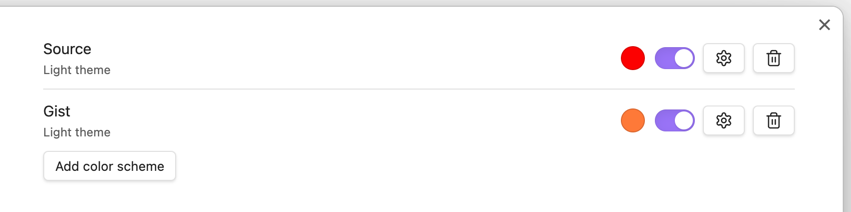

# Themed Highlighter Plugin
Plain plugin that does the minimum number of things one would expect from a highlighter
and adapts to theme changing

The plugin hasn't been submitted to the Obsidian team for review yet, however, I might do it one day
once I have some time to polish it in terms of Obsidian best practice

## Disclaimer
This plugin is inspired by the [Highlightr plugin](https://github.com/chetachiezikeuzor/Highlightr-Plugin) which I've used for some time. However,
I needed that color adaptation as links become barely visible in highlits when the theme switches

## Concept
The core concept of the plugin is the "color scheme". The color scheme is a combination of a name, light-theme color and a dark-theme color
which automatically switch when the Obsidian theme is changed

Here's how it looks like:

The toggle allows you to switch between the light and dark theme colors. Note that you cannot modify them directly
from here, you can only view them. To modify them, click the gear icon

## What the plugin can do
1. Add/update/remove color schemes
2. Apply color schemes
3. Dynamically switch color schemes once the theme changes

## What the plugin cannot do
There're a few things the plugin cannot do:
1. It doesn't work with custom themes as it's bound only to the default light and dark themes
2. It doesn't support different highlighting styles, there's only one
3. It doesn't have different icons for mobile so every command in the palette will have the same icon :D

## Installation
Follow the instructions in the [official Obsidian dev docs](https://docs.obsidian.md/Plugins/Getting+started/Build+a+plugin) to build
the plugin and use it in your vault(s)
